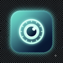
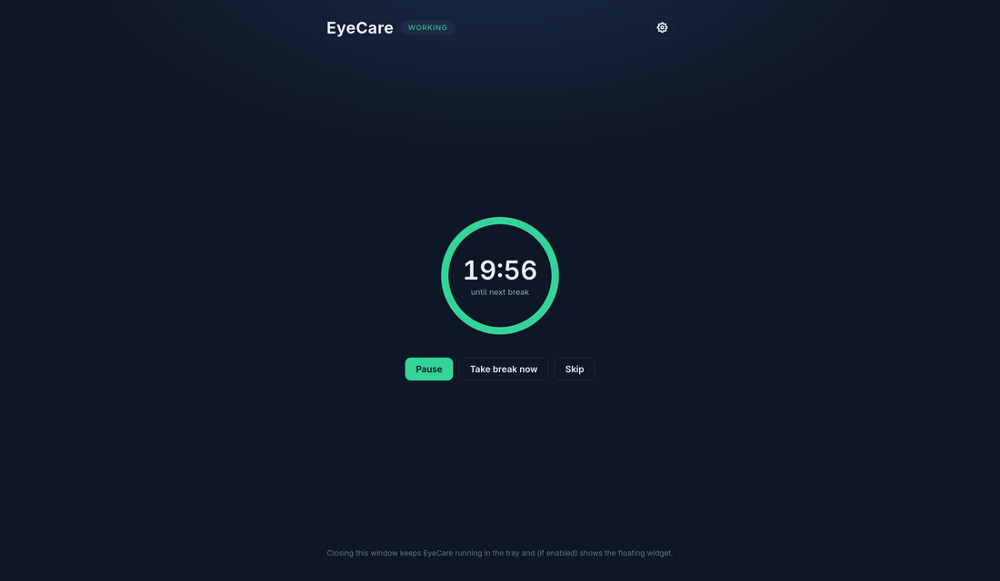
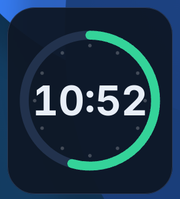
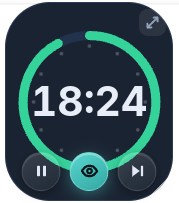
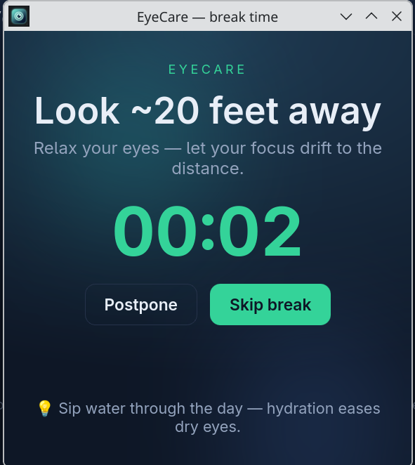

<div align="center">



# EyeCare

**A lightweight, cross-platform eye-health & break reminder.**
Built with [Tauri v2](https://tauri.app) — a Rust core and a tiny web UI.

[](LICENSE)


</div>

> Staring at a screen strains your eyes. EyeCare nudges you to follow the
> **20‑20‑20 rule** — every 20 minutes, look ~20 feet (6 m) away for 20 seconds —
> and adds gentle wellbeing reminders so you actually keep the habit.

<div align="center">

</div>

---

## ✨ Features

**Core timer**
- Adjustable **work interval** and **break length**, run by a precise Rust timer that survives webview reloads.
- **Pre-break warning** so a break never slams up mid-sentence.
- **Escalation levels** — gentle notification · standard window · forced fullscreen overlay.
- **Snooze / postpone** with a max-postpones cap, and **skip**.
- **Long breaks** — every Nth break becomes a longer "stand up & move" break (with a live "≈ once an hour" hint).

**Floating widget**
- A small, always-on-top countdown shown when the main window is minimized.
- **Round / squircle / square**, resizable (drag the corner), adjustable opacity, draggable, remembers its position.
- Quick actions on hover (pause / take break / skip), one-click restore.

<div align="center">

&nbsp;&nbsp;

<br />
<sub>At rest · and on hover — pause, take a break, skip (plus resize & restore).</sub>
</div>

**Wellbeing nudges** (all optional)
- **Blink** reminders, **hydration**, **posture**, **eye-drops / artificial tears**, and an **evening warm-screen** nudge.
- **Guided eye-exercises** and **calming visuals** on the break screen, plus rotating **eye-care tips**.

**Stay out of the way**
- **Idle pause** — freezes when you step away.
- **Work hours + weekdays** — only remind during the hours/days you choose.
- **Respect OS Do-Not-Disturb** and **fullscreen apps** — auto-hides the widget and softens breaks during screen-share / presentations.

**Quality of life**
- **System tray** with quick menu + live countdown, **single-instance**, **launch at login**.
- **Global hotkeys** (pause / skip / take break / postpone / hide widget).
- **Habit stats & streaks** (local-only, no telemetry), **accent theme**, **reduce-motion / high-contrast**, **settings import/export**.
- Per-feature explanations in Settings so every option is self-describing.

<div align="center">

</div>

---

## 📦 Install

### Linux (Debian / Ubuntu / Kali …)
Download the `.deb` from [Releases](https://github.com/frankmaruf/EyeCare/releases), then:
```bash
sudo apt install ./EyeCare_<version>_amd64.deb
```
It appears in your application menu as **EyeCare**. An **AppImage** (portable, no install) is also provided.

### Windows / macOS
Grab the `.msi` / `.exe` (Windows) or `.dmg` (macOS) from [Releases](https://github.com/frankmaruf/EyeCare/releases).

> Builds are produced on each target OS — Tauri does not cross-compile easily.

---

## 🛠 Build from source

**Prerequisites:** [Rust](https://rustup.rs) + [Node.js](https://nodejs.org). On Debian/Ubuntu/Kali also install the Tauri system deps:
```bash
sudo apt install -y libwebkit2gtk-4.1-dev build-essential curl wget file \
  libxdo-dev libssl-dev libayatana-appindicator3-dev librsvg2-dev pkg-config
```

```bash
git clone https://github.com/frankmaruf/EyeCare.git
cd EyeCare
npm install

npm run tauri dev        # run in development
npm run tauri build      # build installers for the current OS
```
Artifacts land in `src-tauri/target/release/bundle/` (`.deb`, AppImage, …).

---

## ⚙️ How it works

- The **timer engine lives in Rust** (a `tokio` 1-second loop) and emits events to the UI — so timing stays accurate and survives UI reloads.
- The **UI is a small TypeScript/Vite app** that just renders state and calls Rust commands.
- **Settings persist as JSON** in your OS config dir; **stats** live in a separate local file. Nothing leaves your machine.

### Platform notes
Some behaviors depend on the display server. On **X11** (and Windows/macOS) everything works fully. On **Wayland**, a few items degrade gracefully:

| Feature | Wayland note |
|---|---|
| Always-on-top widget | EyeCare runs via XWayland so keep-above works |
| Idle pause | needs the X11 screensaver extension; disables itself if unavailable |
| Fullscreen / DND suppression | DND detection works on KDE; fullscreen detection sees XWayland apps |
| Forced overlay | falls back to a window + notification where layer-shell isn't available |

---

## 🚀 Releases & auto-update

EyeCare ships with `tauri-plugin-updater` and a **Check for updates** button (Settings → Updates). It updates **AppImage / Windows / macOS** bundles; an apt-installed `.deb` is updated via your package manager.

To cut a release, build **signed** artifacts and publish them with a `latest.json`:
```bash
export TAURI_SIGNING_PRIVATE_KEY="$(cat ~/.tauri/eyecare.key)"
export TAURI_SIGNING_PRIVATE_KEY_PASSWORD=""     # if the key has one
npm run tauri build -- --bundles appimage         # + nsis / dmg on their OSes
```
Upload the bundle, its `.sig`, and `latest.json` to the GitHub release the updater endpoint points at (`plugins.updater` in `src-tauri/tauri.conf.json`). **Never commit the private key.**

---

## 🗺 Roadmap

Done: MVP timer, widget, escalation/snooze, sound + break-end, global shortcuts, autostart, work-hours/weekdays, idle pause, micro/long breaks, blink/hydration/posture/eye-drops/evening nudges, tips, guided exercises, calming visuals, habit stats, themes, reduce-motion/high-contrast, DND + fullscreen suppression, import/export, updater plumbing.

Later: multi-monitor forced overlay · "always below" widget · click-through/transparent widget · localization (i18n).

Full spec & research: [`docs/requirements.md`](docs/requirements.md).

---

## 🤝 Contributing

Issues and PRs are welcome. Keep changes focused and match the surrounding style (the timer/state lives in `src-tauri/src/lib.rs`; the UI in `src/main.ts`).

## 📄 License

[Apache-2.0](LICENSE) © Md. Abdullah Al Maruf
